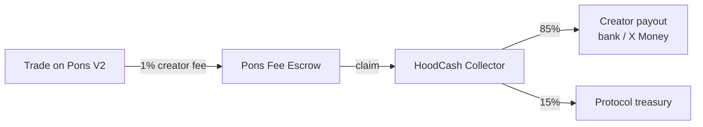

<div align="center">

# HoodCash

**Launch a coin. Route its trading fees straight to any X account — cashable to a bank or X Money.**

[](https://hoodcash.site)
[](https://x.com/Hoodcashsite)
[](https://robinhoodchain.blockscout.com)

</div>

---

## What is HoodCash?

HoodCash is a token launchpad on **Robinhood Chain** built on top of **[Pons](https://ponsfamily.com) V2**. Anyone can launch a token in seconds; every trade of that token pays a **1% creator fee**, and HoodCash routes those fees to the creator's **X (Twitter) handle** — cashable to a **bank account** or **X Money**.

Think *pump.fun*, but the fees land in a real payout rail instead of a wallet you have to babysit.

- ⚡ **One-click launch** on Pons V2 bonding curves
- 💸 **Creator fees → an @handle**, off-ramped to bank / X Money
- 🧾 **Every payout is public**, every receipt is on-chain
- 🖼️ **Coin photos** propagate to Pons and every trading terminal
- 📊 **Live market caps, fees routed, and a public payments feed**

## How the money flows



1. A token launches on Pons V2 with HoodCash set as the **creator-fee recipient**.
2. Trading accrues creator fees (native ETH) into the Pons V2 **fee escrow**.
3. HoodCash **claims** the pooled fees.
4. **85%** is off-ramped to the creator (bank / X Money); **15%** funds the protocol treasury.

## Smart contracts (Robinhood Chain, id 4663)

| Contract | Address |
| --- | --- |
| HoodPaid Router V2 | [`0x764253339DaA2814F685910d94894941DB1268F4`](https://robinhoodchain.blockscout.com/address/0x764253339DaA2814F685910d94894941DB1268F4) |
| Registry | [`0x6D1eEAbC031fa45DF3CBecD0aE4181018Eda384B`](https://robinhoodchain.blockscout.com/address/0x6D1eEAbC031fa45DF3CBecD0aE4181018Eda384B) |
| Pons V2 Factory | [`0x7eD598BcEf8bd9Edd8C97A195C6d13f40801EC7e`](https://robinhoodchain.blockscout.com/address/0x7eD598BcEf8bd9Edd8C97A195C6d13f40801EC7e) |
| Pons V2 Fee Escrow | [`0xd3AFEB2a57f70eF218Aa82451c51B2fb0416Ac9e`](https://robinhoodchain.blockscout.com/address/0xd3AFEB2a57f70eF218Aa82451c51B2fb0416Ac9e) |

## Stack

- **Frontend** — single-file static app (vanilla JS + ethers v6), deployed on Vercel
- **Backend** — Node + TypeScript (Express, viem, better-sqlite3); indexes launches, hosts coin images, runs the fee collector, serves the public payments + off-ramp feeds
- **Contracts** — Solidity (Foundry) — creator-fee router, registry, and the Pons V2 escrow integration
- **Chain** — Robinhood Chain (EVM L2)

## Repository layout

```
src/
  routes/       # launches, payouts, off-ramps, claimables, media (coin images)
  jobs/         # fee collector + on-chain indexer
  chain.ts      # viem clients (resilient RPC transport)
  db.ts         # sqlite schema + helpers
```

## Running locally

```bash
cp .env.example .env   # fill in RPC_URL, contract addresses, keeper key, ADMIN_TOKEN
npm install
npm run dev
```

See `.env.example` for the full configuration. Secrets are never committed — the keeper key, admin token, and API keys live only in the deployment environment.

---

<div align="center">
Built for the Robinhood Chain ecosystem · <a href="https://hoodcash.site">hoodcash.site</a>
</div>
